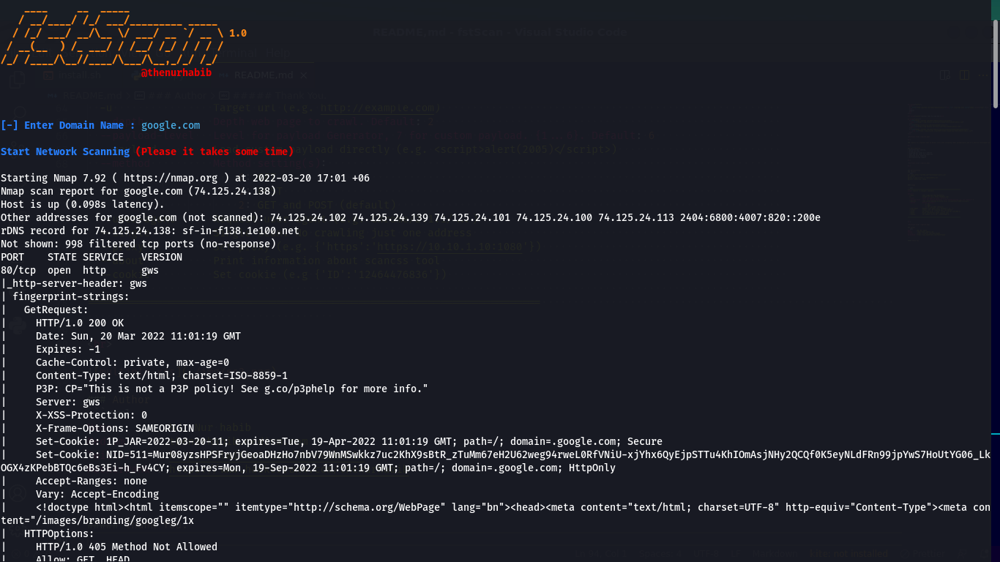
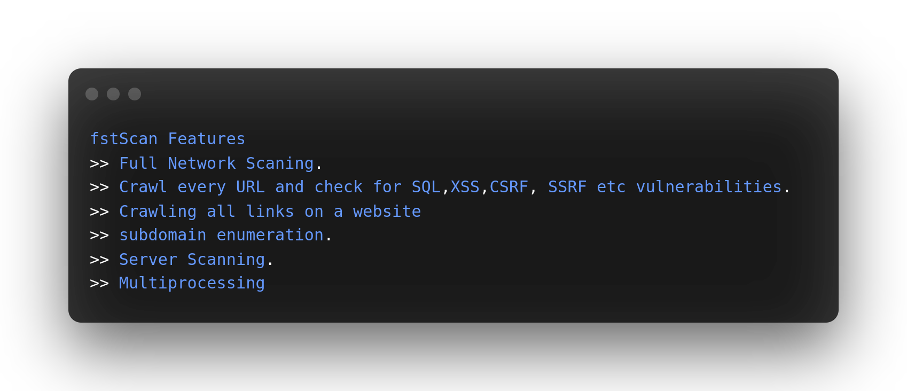
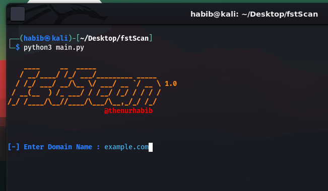

<h1 align="center">
  <br>
  <a  href="https://github.com/thenurhabib/fstscan"></a>
  <br>
  fstScan
  <br>
</h1>

<h4 align="center">Massive Vulnerability scanner.</h4>

<p align="center">
  <a href="https://github.com/thenurhabib/fstscan/releases">
    
  </a>
  <a href="https://travis-ci.com/thenurhabib/fstscan">
    
  </a>
  <a href="https://github.com/thenurhabib/fstscan/issues?q=is%3Aissue+is%3Aclosed">
      
  </a>
</p>



<hr>

### fstScan is a fastest tool scan an entire website.

<br>

### Main Features
- Full Network Scaning.
- Crawl every URL and check for SQL,XSS,CSRF, SSRF etc vulnerabilities.
- Crawling all links on a website
- subdomain enumeration.
- Server Scanning.
- Multiprocessing

<br>






<br>


### Documentation
### install
```yaml
git clone https://github.com/thenurhabib/fstscan.git
cd fstscan
sudo chmod +x install.sh
sudo ./install.sh
```


#### Usage

```yaml

python3 fstscan.py
```
<br>

### Author
```yaml
Name       : Md. Nur habib
Medium     : thenurhabib.medium.com
Twitter    : https://twitter.com/thenurhab1b
HackerRank : https://www.hackerrank.com/thenurhabib

```

##### Thank You.
